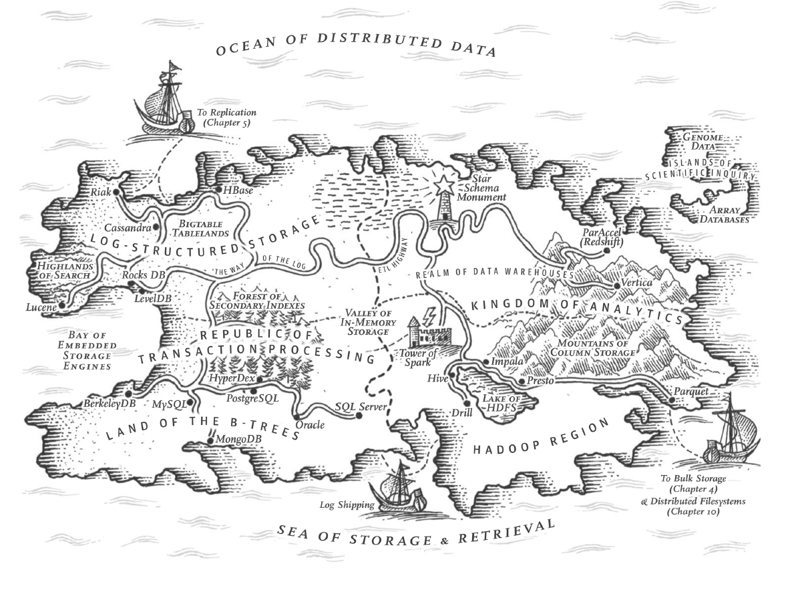
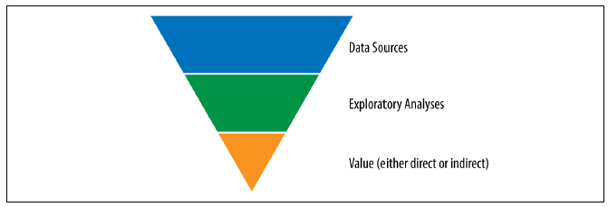
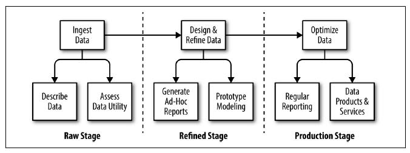
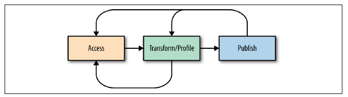

Battery Cycle Life Prediction
=============================

This project is focused on the prediction of battery cycle life. The concept derives from a recent paper (published 
in Nature) called [Data-driven prediction of battery cycle life before capacity degradation](https://www.nature.com/articles/s41560-019-0356-8) by Kristen A. Severson et. al. 

The following article on Medium: [Predicting Battery Lifetime with CNNs](https://towardsdatascience.com/predicting-battery-lifetime-with-cnns-c5e1faeecc8f) replicated the work done in the paper Severson et. al., but used CNNs instead of Elastic Nets. 

The code for the data extraction component of the Nature article (not included in the Medium article code) is available 
here: 

* https://github.com/rdbraatz/data-driven-prediction-of-battery-cycle-life-before-capacity-degradation

The project code is organised as follows (based on CookieCutter data science template - see footnote): 

Project Organisation
--------------------

    ├── LICENSE
    ├── Makefile           <- Makefile with commands like `make data` or `make train`
    ├── README.md          <- The top-level README for developers using this project.
    ├── data
    │   ├── external       <- Data from third party sources.
    │   ├── interim        <- Intermediate data that has been transformed.
    │   ├── processed      <- The final, canonical data sets for modeling.
    │   └── raw            <- The original, immutable data dump.
    │
    ├── docs               <- A default Sphinx project; see sphinx-doc.org for details
    │
    ├── models             <- Trained and serialized models, model predictions, or model summaries
    │
    ├── notebooks          <- Jupyter notebooks. Naming convention is a number (for ordering),
    │                         the creator's initials, and a short `-` delimited description, e.g.
    │                         `1.0-jqp-initial-data-exploration`.
    │
    ├── references         <- Data dictionaries, manuals, and all other explanatory materials.
    │
    ├── reports            <- Generated analysis as HTML, PDF, LaTeX, etc.
    │   └── figures        <- Generated graphics and figures to be used in reporting
    │
    ├── requirements.txt   <- The requirements file for reproducing the analysis environment, e.g.
    │                         generated with `pip freeze > requirements.txt`
    │
    ├── setup.py           <- makes project pip installable (pip install -e .) so src can be imported
    ├── src                <- Source code for use in this project.
    │   ├── __init__.py    <- Makes src a Python module
    │   │
    │   ├── data           <- Scripts to download or generate data
    │   │   └── make_dataset.py
    │   │
    │   ├── features       <- Scripts to turn raw data into features for modeling
    │   │   └── build_features.py
    │   │
    │   ├── models         <- Scripts to train models and then use trained models to make
    │   │   │                 predictions
    │   │   ├── predict_model.py
    │   │   └── train_model.py
    │   │
    │   └── visualization  <- Scripts to create exploratory and results oriented visualizations
    │       └── visualize.py
    │
    └── tox.ini            <- tox file with settings for running tox; see tox.readthedocs.io

--------

Please feel free to check out the code, run it and improve it as you see fit. 

**To Note: Before running the code you will need to download the data.**

* You can download the data here: 
  [Data](https://drive.google.com/drive/folders/1JPBqZARmIS2ZnMdHuGr49qHGFN5OAAzB?usp=sharing) 
* It might take a while as the file is 6GB in size. 
* Unzip the data into the "data" directory above (unzipped 9GB).
* You should now be ready to run the code. 

Also, you can use the _virtualenv_ in venv to run the code (it is up to date): 

_. .\venv\Scripts\activate_

Else you can use the _requirements.txt_ file to set up an environment of your own. 

Lastly, use the _src.data.make_data.py_ module to enable or disable GPU support for Tensorflow. The code to enable 
or disable comes just after the module imports, it sets an environment variable to do the job - this works from
Tensorflow 2 onwards. Not using GPU support will only affect training in this project. Data Wrangling is obviously 
not affected, which takes up most of the time. An interesting side project would be to measure the speedup between 
GPU and non-GPU! 

The code can be run from the command line from the project root by using: 

_python -m src.data.make_data <input_filepath> <output_filepath>_

You can provide the code base directory as input and output paths for the moment, these variables are not currently 
used. 

This command will do the following: 

* Read data from matlab files, and convert to pickled Python dictionary.
* Wrangle data by: cleaning data, converting time-series variables to same scale, imputing missing values, dropping 
  outliers and creating new features. 
* Create tensorflow file format, and output file to tensorflow formatted files. 
* Read data from tensorflow format, build CNN. 
* Save CNN to file through callback function.

This can be followed up with making predictions using the model by: 

_python -m src.data.predict_model_

* Reads saved tensorflow CNN from file.
* Read prediction data from dataset. 
* Apply model to prediction set. 
* Calculater accuracy of result.
* Report results. 

There are various Jupyter notebooks in the notebook directory, that visualise results and can be used to run all of 
the data transformation and model building manually. 

Please let me know if you struggle to get the code work, I will try my best to assist you to get it up and running. 

I did install CUDA on my system, and do have an NVIDIA card. You can run the code without this, and you can also 
adapt it to run on GoogleCloud API, but I have not done so yet. Feel free to implement this though! Let me know if 
you need help on this. 

## Background

The objective of this project is however to consider the best data architecture, for a more generic problem i.e. how 
to deploy such a system in a hypothetical environment, with features similar to those described in the Nature 
article - but which are entirely fictional and only used for the purpose of studying Systems Architecture.

## The Problem

As Data Scientists, we are stranded on the island of scientific inquiry. 

(Kleppmann, 2017)

We need to make our way to the Kingdom of Analytics, without getting lost in the Mountains of Column Storage, 
drowning in the Ocean of Distributed Data or being lured astray by the Star Schema Monument. 

We need to come up with a strategy to ensure the Islands of Scientific Inquiry are firmly connected to the Kingdom 
of Analytics. 

## Our Fictional Organisation

We are a new team of Data Scientists working for a large multi-national car company with a strategy to make the best 
electric vehicles. The company has many research laboratories doing research on battery technologies to invent the 
best battery that would optimise their business returns. They have the best scientists performing many tests on 
complex laboratory systems that measure many different aspects of battery performance. The equipment output files in 
CSV format, and the scientists only know how to use Excel. They perform incredibly complex calculations in Excel 
spreadsheets of Gigabytes in size. The spreadsheets are stored on local lab machines. Until now these highly qualified 
scientists have lived a happy live knowing not many can understand their work and no-one will probably ever decipher their
convoluted Excel spreadsheets. They had perfect job security and career fullfilment!

Recently a team from Stanford published a paper on predictive models that can predict the lifetime of a battery by 
only testing the first 50 discharge cycles. Usually all batteries have to be tested for 1500 cycles, this is truly 
a revolutionary improvement and management want to start implementing this on the company's data. They also don't 
want to invest in a system do aggregate data for single purpose, so want the proposed system to also replicate all 
the logic in the scientist's Excel spreadsheets! The scientists are obviously not very pleased, they like Excel!

As the new data science team, you are tasked with coming up with a data management architecture to accomplish this goal!

How exciting!

## The Challenge

What would the best architecture be for such a system? Some of the things you should consider are: 

* The data value funnel and which tools our battery scientists should use to extract value in this new world we will be 
  introducing them to? 

(Rattenbury et al., 2017)
*  How would a data workflow fit into this new archicture? Who will do what in this workflow?

(Rattenbury et al., 2017)
* Should we treat raw data differently to derived data? If so, how?

(Rattenbury et al., 2017)
* Do we need a data lake?
* Do we need a data warehouse?
* Should we go with cloud or on-premise?
* What tools should we use for each part of the architecture. 

## The Assignment

We should go forth and design a tangible system that ingests the battery data from various laboratories in different 
countries. The data are source files in CSV as well as Excel Spreadsheets. Some of the battery testing equipment also 
has SQL databases attached that store data regarding tests - this is however not the norm. 

The data need to be accurately curated. The system needs to be able to do laboratory reporting. The system must 
enable us to use the data in new ways previously not possible. The system must be flexible enough to adapt to new 
data formats for future growth of the company. The company is thinking of expanding into Wind Energy and might need 
to introduce data from these sources at some future points. The system can also not be expensive, the company is 
going through a downturn and need to cut costs. The system will need to be built using the cheapest components 
possible. Most importantly, the system must put a smile on the scientists faces and give them a new reason for 
finding fulfillment in their jobs!

There is no right and wrong, be as creative as you can! The main thing is to back up your answers with 
justifications as best you can. 

Let us try to have a lively debate around this. We can schedule a call if you think this is an interesting problem. 

If not, compile the code and play with the Tensorflow models!

Above all else, have fun!

## References

* Attia, P. M., Grover, A., Jin, N., Severson, K. A., Markov, T. M., Liao, Y. H., Chen, M. H., Cheong, B., Perkins, N.
, Yang, Z., Herring, P. K., Aykol, M., Harris, S. J., Braatz, R. D., Ermon, S., & Chueh, W. C. (2020). Closed-loop optimization of fast-charging protocols for batteries with machine learning. Nature, 578(7795), 397–402. https://doi.org/10.1038/s41586-020-1994-5
* Kleppmann, M. (2017). Designing Data-Intensive Applications: The Big Ideas behind Reliable, Scalable, and 
  Maintainable Systems. In O’Reilly Media, Inc. https://www.oreilly.com/library/view/designing-data-intensive-applications/9781491903063/%0Ahttp://shop.oreilly.com/product/0636920032175.do
* Rattenbury, T., Hellerstein, J. M., Heer, J., Kandel, S., & Carreras, C. (2017). Principles of Data Wrangling.
* Severson, K. A., Attia, P. M., Jin, N., Perkins, N., Jiang, B., Yang, Z., Chen, M. H., Aykol, M., Herring, P. K., 
  Fraggedakis, D., Bazant, M. Z., Harris, S. J., Chueh, W. C., & Braatz, R. D. (2019). Data-driven prediction of battery cycle life before capacity degradation. Nature Energy, 4(5), 383–391. https://doi.org/10.1038/s41560-019-0356-8

<small>Project based on the <a target="_blank" href="https://drivendata.github.io/cookiecutter-data-science/">cookiecutter data science project template</a>. #cookiecutterdatascience</small>

